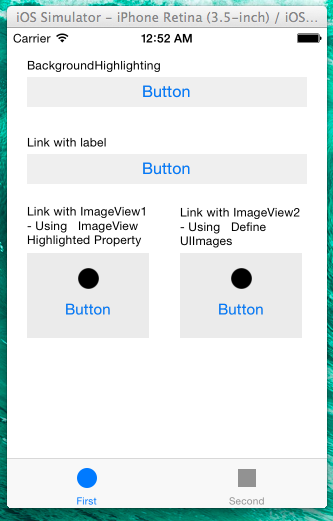

MintMixButton
=============

iOS Extended UIButton with Styling. This Button able to more flexible button with data and styling.
* Let UIBUtton have NSDictionary or NSArray .. etc
* Set Highlighted Background color, SelectedBackground color!
* Link a UILabel and UIButton action effect to UILabel's color normal, highlighted, selected.
* Link a UIImageView and UIButton action effect to UIImageView's image normal, highlighted, selected. UIButton is not able to set align horizonal inner image and title. But Use it can.


Sample Screen
========



Use
========
1. Copy MintMixButton.h, MintMixButton.m to your Project and Import
2. Make your UIButton object's class to MintMixButton.(If you use xib, You can change a your button on Custom Class pane of Identity Inspector(Opt + Cmd + 3).
3. Set link or MintMixButton'sproperties.

Styling Functions
========

PLEASE CHECK OUT SAMPLE PROJECT FOR MORE IMPORMATIONS

######Button's Background Color
```objective-c
self.ui_backgroundHighlightingButton.normalBackgroudColor = [UIColor colorWithRed:0.937255 green:0.937255 blue:0.937255 alpha:1.000000];
self.ui_backgroundHighlightingButton.highlightedBackgroudColor = [UIColor colorWithRed:0.690196 green:0.737255 blue:0.843137 alpha:1.000000];
```

######Link with UILabel and change label color on button action
```objective-c
self.ui_linkWithLabelButton.linkedLabel = self.ui_linkWithLabel;
self.ui_linkWithLabelButton.linkedLabelHighlightedColor = [UIColor blueColor];
self.ui_linkWithLabelButton.linkedLabelNormalColor = [UIColor blackColor];
```

######Link with UIImageView and change image on button action
```objective-c
// TYPE 1: Link with ImageView1-Using ImageView's Highlighted Property(Need to set UIImageView's Highlighted Property)
self.ui_linkWithImgButton1.linkedImageView = self.ui_linkWithImg1;

// TYPE 2: Link with ImageView2-Using Define UIImages
self.ui_linkWithImgButton2.linkedImageView = self.ui_linkWithImg2;
self.ui_linkWithImgButton2.linkedImageViewNormalImage = [UIImage imageNamed:@"first"];
self.ui_linkWithImgButton2.linkedImageViewHighlightedImage = [UIImage imageNamed:@"second"];
```

DATA Store Functions
========
To have a data on MintMixButton, set with these properties.
@property NSMutableDictionary *mutableDict;
@property NSDictionary *dict;
@property NSArray *array;
@property NSMutableArray *mutableArray;
@property NSObject *data;
```objective-c
self.mintMixButton.dic = myDic;
```

